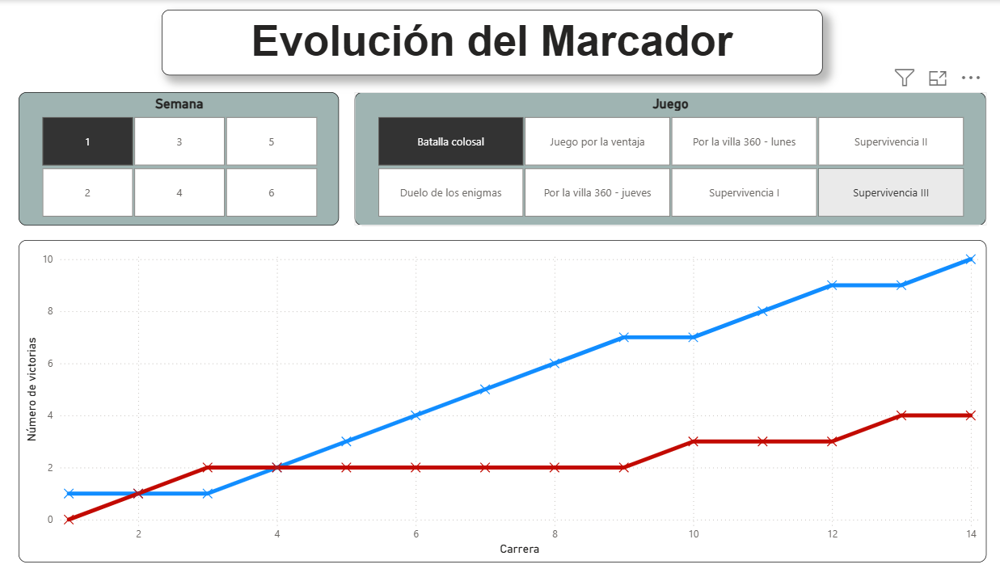

# 📊 Sistema de Inteligencia Deportiva: Exatlón México

## 🎯 Resumen del Proyecto
Este proyecto de Business Intelligence transforma datos históricos brutos del reality show deportivo "Exatlón México" en un modelo analítico interactivo. Desarrollado íntegramente en **Power BI**, el sistema permite a los *stakeholders* analizar el rendimiento individual de los atletas y reconstruir la narrativa competitiva de los enfrentamientos por equipos, facilitando decisiones basadas en datos.

## ⚙️ Arquitectura de Datos y ETL (Power Query)
El principal desafío técnico de este proyecto residía en la fuente de origen: la información se extrajo de archivos de Excel donde los datos estaban segmentados en diversas tablas y carecían de una estructura óptima para el análisis.

Para solucionar esto, se implementó un flujo ETL robusto utilizando **Power Query**:
* **Extracción y Limpieza:** Consolidación de múltiples hojas de cálculo, eliminación de redundancias y tratamiento de valores nulos.
* **Transformación:** Modelado de los datos para pasar de un formato de "reporte visual" en Excel a un modelo relacional estructurado (Esquema Estrella), garantizando la integridad referencial.

## 📈 Dashboards y Lógica de Negocio

### 1. Tablero: Porcentaje de Victorias 🏆
Este tablero está diseñado para medir la efectividad individual.
* **Valor de Negocio:** Permite filtrar el rendimiento de cada atleta por semana. Esta métrica es crucial para proyectar qué competidores están estadísticamente en riesgo de ir al duelo de eliminación dominical, dependiendo de los resultados en las series de supervivencia.

### 2. Tablero: Evolución del Marcador ⏱️
Una herramienta visual para el *Data Storytelling* de las competencias grupales.
* **Valor de Negocio:** Visualiza la evolución punto a punto del marcador en los juegos de equipo. Ofrece una forma atractiva e inmediata de recordar la narrativa del juego: permite identificar rápidamente si un equipo dominó por completo el circuito, si hubo remontadas históricas o si fue un enfrentamiento sumamente reñido.

